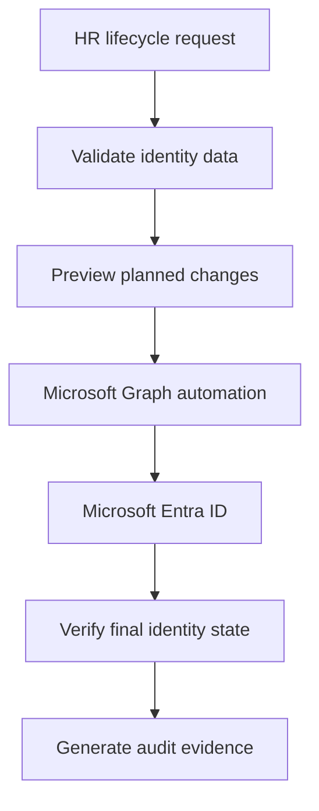

Microsoft Entra ID JML Automation

A PowerShell and Microsoft Graph lab project that automates Joiner, Mover, and Leaver identity lifecycle processes in Microsoft Entra ID.

Project Overview

This project simulates an enterprise IAM workflow receiving employee lifecycle requests from an HR system through CSV files. The automation validates each request, performs the appropriate identity and access changes, verifies the resulting state, and produces audit evidence.

Technologies

- Microsoft Entra ID
- Microsoft Graph PowerShell SDK
- PowerShell 7
- CSV and XML data processing
- Git and GitHub
- Role-based access control (RBAC)
- Joiner-Mover-Leaver lifecycle management

Architecture



Joiner Workflow

1. Imports new-hire records from CSV.
2. Validates required identity attributes.
3. Rejects malformed or duplicate records.
4. Generates a strong temporary password.
5. Creates the Entra ID account.
6. Requires a password change at first sign-in.
7. Assigns department-based security groups.
8. Stores temporary credentials using Windows encryption.
9. Creates a password-free audit record.
10. Skips accounts that already exist.

Example department groups:

- `SG-IAM-Finance`
- `SG-IAM-HumanResources`
- `SG-IAM-InformationTechnology`

Mover Workflow

1. Validates the approved employee-change request.
2. Verifies the employee ID and current department.
3. Confirms the source and target groups.
4. Grants the new department access.
5. Updates department and job-title attributes.
6. Removes outdated department access.
7. Records the change in an audit log.
8. Detects requests that were already completed.

Leaver Workflow

1. Validates the termination request and effective date.
2. Confirms the employee ID and account.
3. Disables the account.
4. Revokes active sign-in sessions.
5. Removes IAM-managed group access.
6. Preserves the account for audit and retention.
7. Records the completed offboarding actions.
8. Detects previously completed requests.

Security Controls

- Least-privilege Microsoft Graph permissions
- Input validation before tenant changes
- Employee ID verification
- Department-to-group RBAC mapping
- Duplicate-processing prevention
- Preview scripts before execution
- Encrypted temporary credential storage
- Credential files excluded through `.gitignore`
- Password-free audit logs
- Post-change verification
- Account preservation instead of immediate deletion

Microsoft Graph Permissions

The lab uses delegated access with the following permissions:

- `User.ReadWrite.All`
- `Group.ReadWrite.All`
- `User-PasswordProfile.ReadWrite.All`
- `User.RevokeSessions.All`

Permissions should be reviewed and reduced where possible before adapting the project for production.


 Repository Structure

```text
Entra-JML-Automation-Public/
|-- data/
|   |-- new-hires.csv
|   |-- invalid-hires.csv
|   |-- mover-requests.csv
|   `-- leaver-requests.csv
|-- logs/
|   |-- joiner-audit.csv
|   |-- mover-audit.csv
|   `-- leaver-audit.csv
|-- scripts/
|   |-- New-DepartmentGroups.ps1
|   |-- Test-JoinerInput.ps1
|   |-- Test-JoinerPlan.ps1
|   |-- Invoke-JoinerProvisioning.ps1
|   |-- Repair-JoinerCredentials.ps1
|   |-- Test-MoverPlan.ps1
|   |-- Invoke-MoverProvisioning.ps1
|   |-- Test-LeaverPlan.ps1
|   `-- Invoke-LeaverProvisioning.ps1
|-- docs/
|-- .gitignore
`-- README.md
```

Prerequisites

- PowerShell 7 or later
- Microsoft Graph PowerShell SDK
- Microsoft Entra ID test tenant
- An authorized lab administrator account

Install the Graph SDK:

```powershell
Install-Module Microsoft.Graph -Scope CurrentUser
```

Testing Performed

- Valid Joiner input
- Invalid UPN rejection
- User creation
- Department-group assignment
- Duplicate-user prevention
- Mover attribute updates
- Removal of outdated access
- Leaver account disabling
- Sign-in session revocation
- IAM access removal
- Repeat-execution safety
- Audit-log generation
- Credential-export error recovery

Troubleshooting Example

During batch onboarding, the accounts and group memberships were created successfully, but encrypted credential export failed because a single imported PowerShell object was not treated as an array.

The actual Entra ID state was verified before retrying. The script was corrected by explicitly wrapping the imported object as an array, affected passwords were securely reset, and the recovery actions were documented.

This demonstrated the importance of checking the actual identity state before repeating an automation workflow.

Disclaimer

This project was built and tested in a personal lab tenant using fictional identities. It is intended for educational and portfolio purposes. Production use would require organizational approval, formal change control, secure workload authentication, monitoring, and additional testing.

